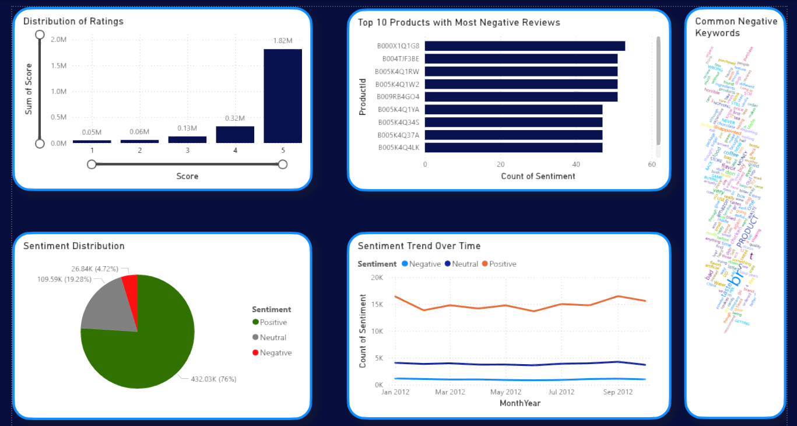
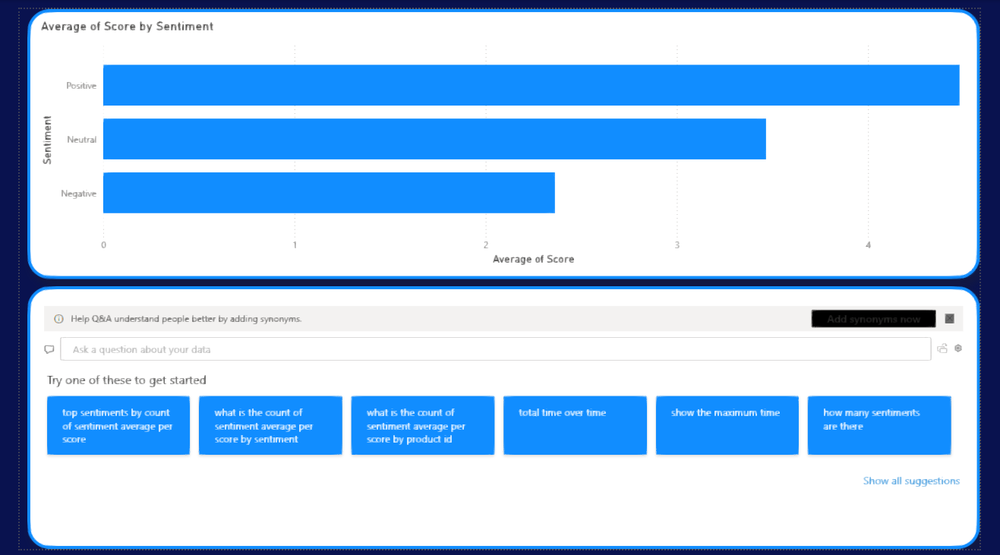
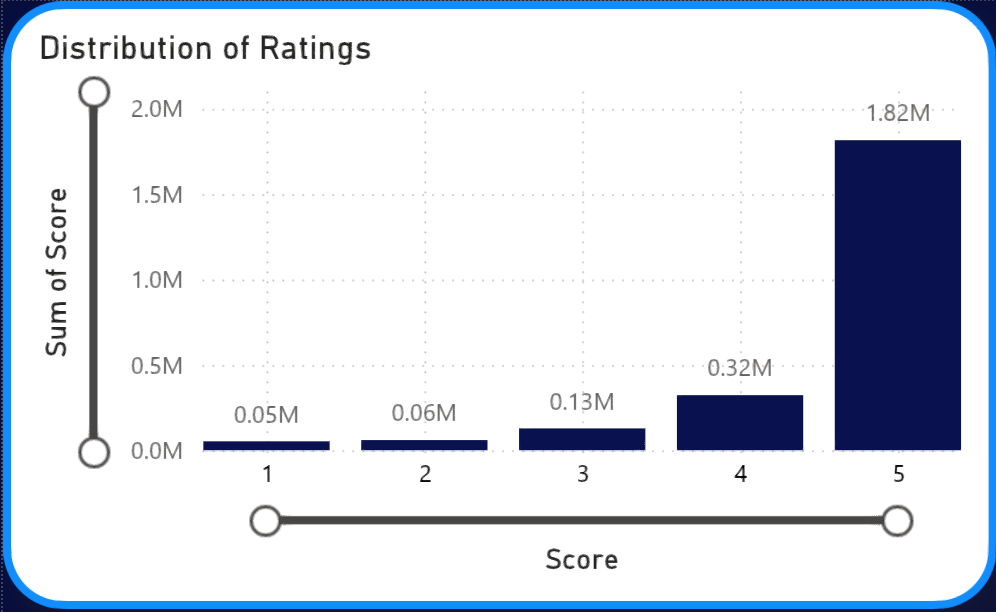
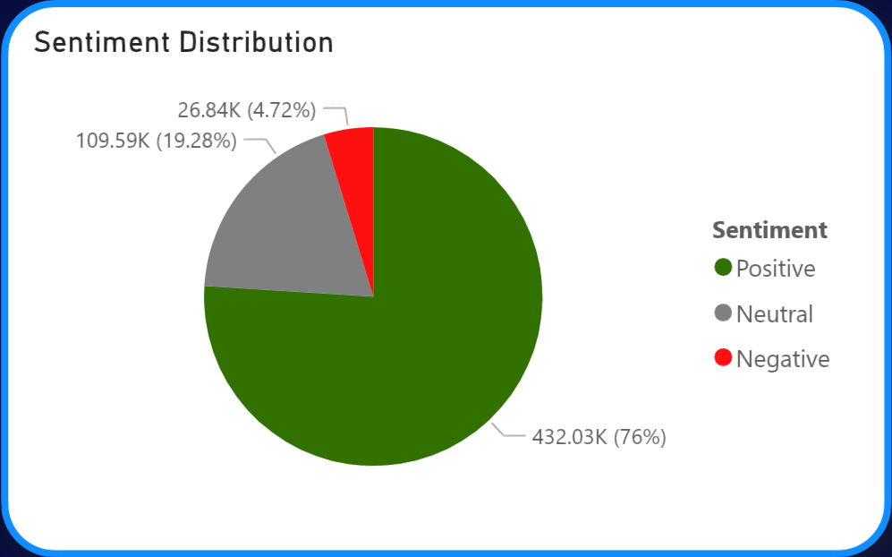
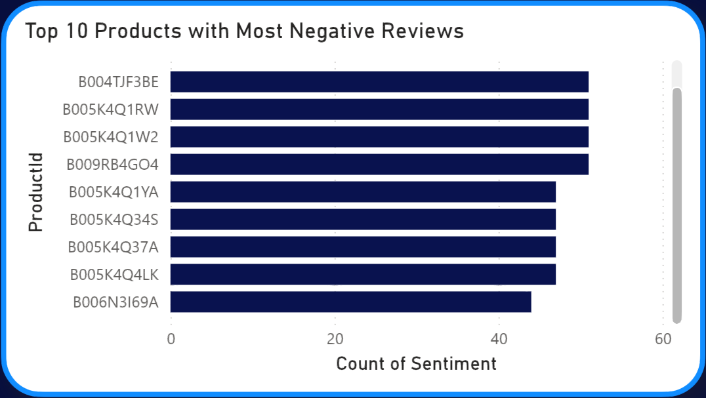
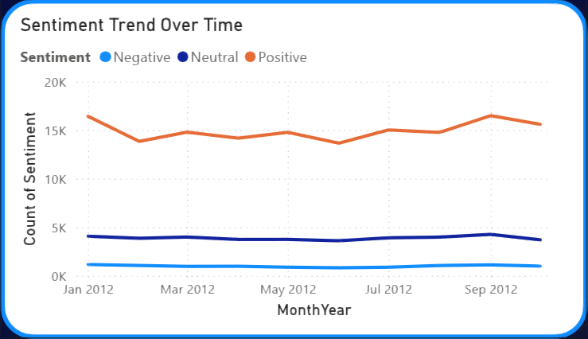
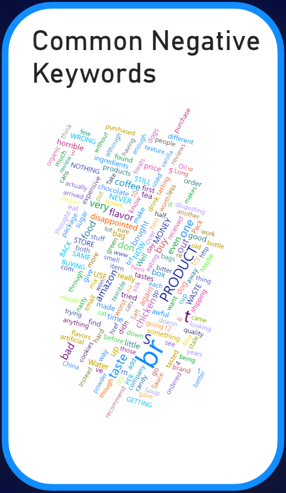
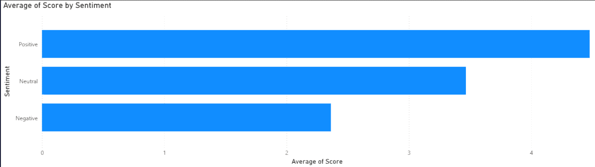

# ✨ Amazon Product Review Analysis: Business Intelligence Solution ✨

## 🚀 Project Overview

This repository contains a comprehensive Business Intelligence (BI) solution focused on analyzing Amazon product reviews, developed as part of the **PUSL2079: Topics in Business Analytics & Intelligence** coursework at the University of Plymouth.

The project includes a detailed case study on Amazon's use of business analytics and a custom BI solution to analyze customer product reviews, delivering actionable insights to enhance customer satisfaction and product quality.

---

## 🎯 Objectives

- Conduct a case study on how Amazon leverages business analytics to address operational and customer-centric challenges.
- Design and implement a robust BI solution to identify patterns in customer reviews, focusing on negative feedback to improve product listings and reduce return rates.

---

## 🛠️ Project Scope & Implementation

The project was meticulously executed, covering every phase from problem definition to actionable recommendations. Key tasks included:

- 🎯 **Problem Definition**
- 📊 **Data Collection & Selection** (Amazon Product Reviews from Kaggle)
- 🧹 **Data Cleaning & Preprocessing** (Power BI Power Query + Python)
- 🧠 **Sentiment Analysis** (Python, TextBlob)
- 📈 **EDA & Visualization** (Power BI)
- 💡 **Recommendations**
- ✍️ **Documentation & Referencing**
- 🤝 **Ethical Considerations**

---

## 📂 Power BI Dashboard File

You can download and explore the Power BI dashboard file here:  
[Amazon Product Review Analysis - Power BI File](https://liveplymouthac-my.sharepoint.com/:u:/g/personal/10952412_students_plymouth_ac_uk/Ednw0d0wPo1Bn04uxT9dMDoBX1rmhQ-z2J6JxNrKLIXd4Q?e=SidwIg)

---

## 🧠 Skills Learned

As part of the **Amazon Product Review Analysis: Business Intelligence Solution** project, the following skills and tools were applied and developed:

### 🔧 Tools & Technologies
- **Power BI**
  - Dashboard Design
  - Power Query (Data Cleaning & Transformation)
  - DAX (Calculated Columns & Measures)
- **Python**
  - Data Preprocessing (pandas, numpy)
  - Sentiment Analysis (TextBlob)
  - Word Cloud Generation (matplotlib, wordcloud)

### 📊 Data Analysis & BI Skills
- Data Visualization
- Exploratory Data Analysis (EDA)
- Natural Language Processing (NLP)
- Business Intelligence Reporting
- Interactive Q&A Interface Development

### 📈 Business & Communication Skills
- Business Problem Definition
- Case Study Research
- Insight Generation & Interpretation
- Recommendation Writing
- Ethical Considerations in Data Usage
- Stakeholder-Oriented Reporting

---

## 📈 Exploratory Data Analysis & Visualizations (Power BI)

  

### 1️⃣ Histogram of Ratings (Figure 1)

  
**Insight**: Most reviews are 4-5 stars (1.82M for 5 stars, 0.32M for 4 stars), but 1-2 star reviews highlight improvement areas.  
**Action**: Investigate low-rated reviews.

---

### 2️⃣ Pie Chart of Sentiment (Figure 2)

  
**Insight**:

- 76% Positive (432.03K)
- 19.28% Neutral (109.59K)
- 4.72% Negative (26.84K)  
  **Action**: Leverage positive sentiment; fix negative patterns.

---

### 3️⃣ Bar Graph – Negative Reviews by Product (Figure 3)

  
**Insight**: Products like B000X1Q1G8 receive high negative reviews.  
**Action**: Prioritize those for quality checks.

---

### 4️⃣ Line Chart – Sentiment Trend Over Time (Figure 4)

  
**Insight**: Positive sentiment fluctuated; others remained stable.  
**Action**: Prepare for seasonal patterns.

---

### 5️⃣ Word Cloud – Negative Keywords (Figure 5)

  
**Insight**: Keywords like “broken,” “cheap,” and “return” indicate common issues.  
**Action**: Improve product and delivery quality.

---

### 6️⃣ Bar Chart – Average Rating by Sentiment (Figure 6)

  
**Insight**:

- Positive ≈ 4.5
- Neutral ≈ 3.5
- Negative < 2.5  
  **Action**: Focus on converting neutral to positive.

---

### 7️⃣ Interactive Q&A Interface

**Insight**: Enables real-time dynamic querying.  
**Action**: Support stakeholders with fast, flexible insight.

---

## 💡 Recommendations

- **Improve Product Quality** – Focus on products with high complaints (e.g., B000X1Q1G8).
- **Enhance Holiday Operations** – Plan for seasonal demand spikes.
- **Leverage Positive Sentiment** – Use in branding and campaigns.
- **Streamline Returns** – Improve logistics and return experience.
- **Refine Product Descriptions** – Avoid misleading terms.
- **Engage Neutral Customers** – Deliver upgrades to improve ratings.

---

## 🤝 Ethical Considerations

- **Data Privacy** – No PII included.
- **Transparency** – All steps are documented.
- **Fair Use** – Used for academic learning purposes.
- **Bias Mitigation** – Validated sentiment analysis across product groups.

---

## 📚 References

- Amazon Web Services – [Case Studies](https://aws.amazon.com/solutions/case-studies/amazon/)
- AWS – [Machine Learning at Amazon](https://aws.amazon.com/machine-learning/)
- Kaggle – [Consumer Reviews of Amazon Products](https://www.kaggle.com/datasets/datafiniti/consumer-reviews-of-amazon-products)
- Forbes – [How Amazon Uses Big Data](https://www.forbes.com/sites/bernardmarr/2022/06/01/how-amazon-uses-big-data-and-analytics-to-boost-sales/)
- Microsoft – [Power BI Community Blog](https://community.fabric.microsoft.com)
- TextBlob – [Documentation](https://textblob.readthedocs.io/en/dev/)
- Provost, F., & Fawcett, T. (2013). _Data Science for Business_. O’Reilly Media.

---
